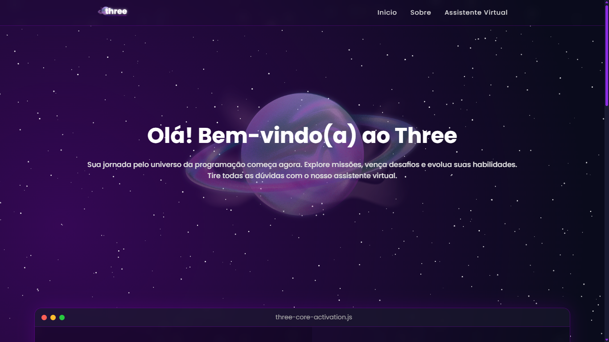
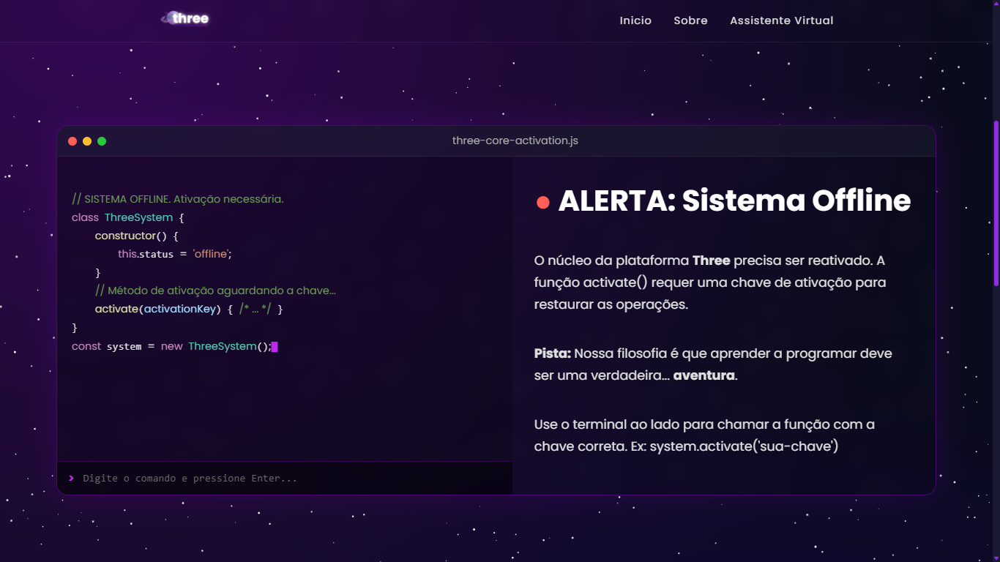
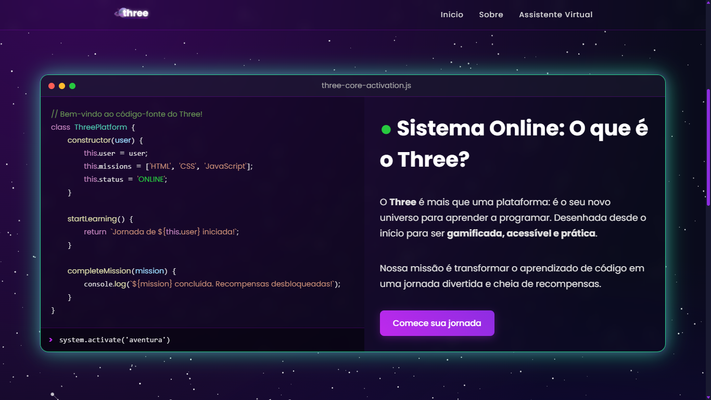
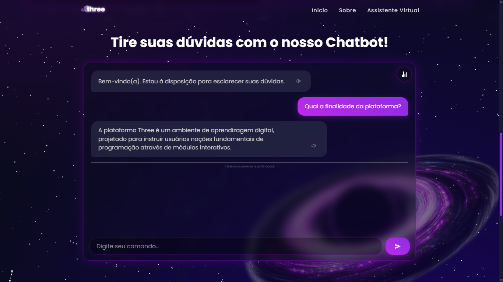
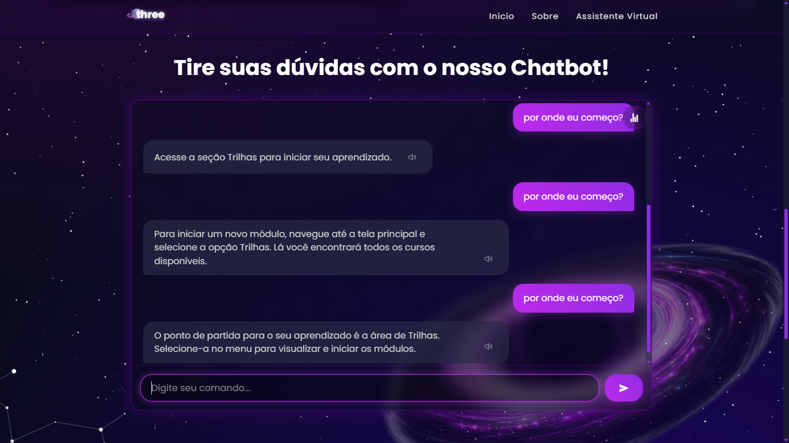
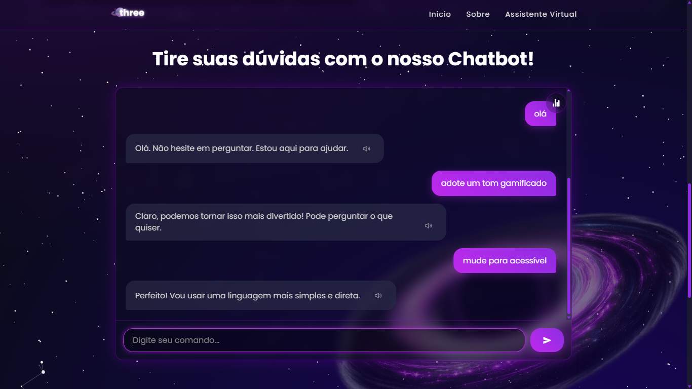
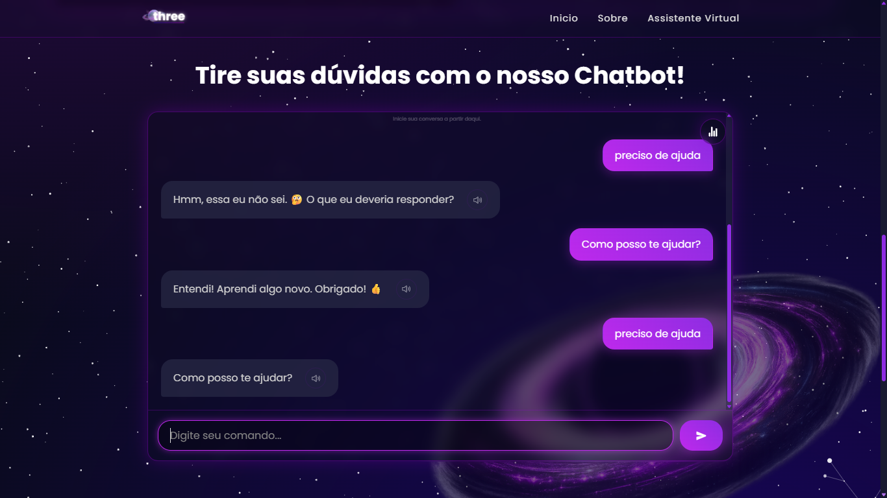
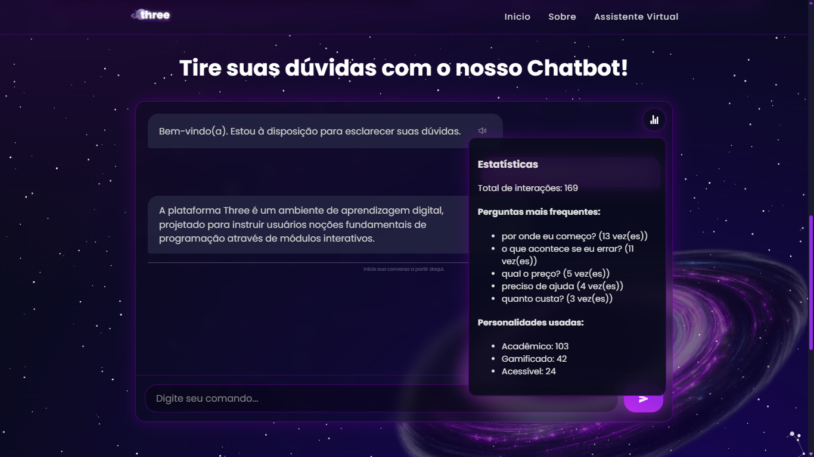

# Chatbot Three

O Chatbot do Three busca atender as dúvidas dos usuários da plataforma, oferecendo suporte e direcionamento.

O Three é uma plataforma gamificada de ensino de programação atualmente em desenvolvimento, idealizada por alunos de Engenharia de Software - UFCA.

## Tecnologias utilizadas
- Backend em Python com o framework Flask
- Frontend com HTML, CSS e JavaScript

## Estrutura base da aplicação
```bash
three-chatbot/
│
├── static/
│   ├── css/
│   ├── js/
│   └── img/
│
├── app/
│   ├── templates/
│   │   └── index.html
│   │
│   ├── __init__.py
│   └── routes.py
│
├── wsgi.py
└── requirements.txt
```

## Executando o projeto na sua máquina

Clone o repositório:
```bash
git clone https://github.com/ufca-es/three-chatbot
```

Crie o ambiente virtual:
```bash
py -3 -m venv .venv
```

Inicialize o .venv:
```bash
.venv\Scripts\activate
```

Instale as dependências (pacotes):
```bash
pip install -r requirements.txt
```

Inicialize o servidor Flask:
```bash
$env:FLASK_APP="wsgi.py"
$env:FLASK_ENV="development"
flask run
```

## Desenvolvido por
- [Sebastião Sousa Soares](https://github.com/SebastiaoSoares) — _Estrutura básica; mudança de personalidade; persistência de aprendizado; interface e responsividade_.
- [Espedito Ramom Mascena Ricarto](https://github.com/RamomRicarto) — _Loop de conversação; fluxo de conversas; variação de respostas; interface e responsividade_.
- [Sabrina Alencar Soares](https://github.com/sabrinaalencaar) — _Banco de perguntas e respostas; histórico; coleta e aproveitamento de estatísticas; relatório final_.

#### Orientador:
- [Jayr Alencar Pereira](https://github.com/jayralencar)

## Demonstração da estrutura e das funcionalidades
### Página Inicial:
Esta é a tela de boas-vindas e o ponto de partida da jornada do usuário.



### Sobre o Projeto:
A seção "Sobre" demonstra a filosofia do projeto com um desafio interativo: o usuário deve "ativar" o sistema através de um comando no terminal para visualizar o conteúdo.




### Chatbot Interativo:
Interface principal de interação com o chatbot. Pensando em uma experiência mais acessível, todas as respostas do assistente virtual contam com um recurso de áudio. O usuário pode clicar no ícone de som (🔊) ao lado da mensagem para ouvi-la em voz alta.



### Variação de Respostas para uma Mesma Pergunta:
Para tornar a conversa mais natural e menos repetitiva, o chatbot é programado para fornecer respostas diferentes para a mesma pergunta.




### Mudança de Personalidade:
O assistente virtual pode adotar três diferentes tons e estilos de conversa para se adaptar melhor ao contexto da interação e ao perfil do usuário.



### Aprendizado Contínuo:
A plataforma possui um mecanismo que permite ao chatbot aprender com as interações, melhorando seu desempenho geral ao longo do tempo.



### Estatísticas e Relatório:
Onde são exibidos os dados de uso que são armazenados durante as interações.

 
